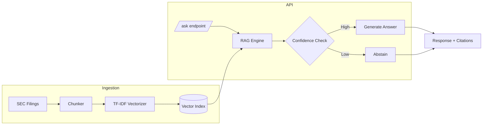

# Financial Filings RAG

A production-ready Retrieval-Augmented Generation (RAG) system for answering questions about SEC financial filings. Built with FastAPI, TF-IDF retrieval, and intelligent abstention for reliable responses.


[](https://github.com/tommieseals/fin-filings-rag/actions/workflows/ci.yml)

## 🎯 Features

- **TF-IDF Retrieval**: Fast, efficient semantic search over financial documents
- **Citation Extraction**: Every answer includes source citations with relevance scores
- **Intelligent Abstention**: System knows when it doesn't know—refuses to hallucinate
- **Production Ready**: Docker support, health checks, structured logging
- **Evaluation Harness**: Built-in testing framework for accuracy measurement

## 🏗️ Architecture



## 🚀 Quick Start

```bash
# Clone and install
git clone https://github.com/tommieseals/fin-filings-rag.git
cd fin-filings-rag
pip install -r requirements.txt

# Add your filings to data/filings/
# (Sample 10-K included)

# Build the index
make ingest

# Run the API
make run
```

## 📡 API Usage

### Ask a Question

```bash
curl -X POST http://localhost:8000/ask \
  -H "Content-Type: application/json" \
  -d '{"question": "What was the total revenue for fiscal year 2023?"}'
```

### Response Format

```json
{
  "answer": "Total revenue for fiscal year 2023 was $2,450 million...",
  "citations": [
    {
      "source": "sample_10k.txt",
      "chunk_id": 5,
      "text": "Total revenue for fiscal year 2023 was $2,450 million...",
      "score": 0.73
    }
  ],
  "confidence": 0.73,
  "abstained": false
}
```

### Abstention Example

When confidence is low, the system abstains:

```json
{
  "answer": "I don't have enough confidence to answer this question...",
  "citations": [],
  "confidence": 0.08,
  "abstained": true
}
```

## 🧪 Testing & Evaluation

```bash
# Run unit tests
make test

# Run evaluation harness
make eval
```

Evaluation output:
```
============================================================
EVALUATION REPORT
============================================================
Total questions:    5
Answered:          4
Abstained:         1
Correct:           5
Accuracy:          100.0%
```

## 🐳 Docker

```bash
# Build image
make docker-build

# Run container
make docker-run
```

## 📁 Project Structure

```
fin-filings-rag/
├── app/
│   ├── main.py          # FastAPI application
│   ├── rag.py           # RAG engine with TF-IDF retrieval
│   └── schemas.py       # Pydantic models
├── ingestion/
│   ├── ingest_texts.py  # Document ingestion pipeline
│   └── chunk.py         # Text chunking utilities
├── eval/
│   ├── run_eval.py      # Evaluation harness
│   └── testset.jsonl    # Test questions
├── data/filings/        # SEC filing documents
├── index/               # Generated TF-IDF index
├── tests/               # Unit tests
├── Dockerfile
├── Makefile
└── requirements.txt
```

## ⚙️ Configuration

Key parameters in `app/rag.py`:

| Parameter | Default | Description |
|-----------|---------|-------------|
| `ABSTENTION_THRESHOLD` | 0.15 | Minimum confidence to answer |
| `TOP_K` | 3 | Number of chunks to retrieve |
| `chunk_size` | 512 | Characters per chunk |
| `overlap` | 64 | Overlap between chunks |

## 🔧 Adding Your Own Filings

1. Place `.txt` files in `data/filings/`
2. Run `make ingest` to rebuild the index
3. The API will automatically use the new index

## 📊 Performance

- **Index Build**: ~1 second per MB of text
- **Query Latency**: <50ms for retrieval
- **Memory**: ~100MB per 10,000 chunks

## 🛣️ Roadmap

- [ ] Add PDF parsing for direct SEC filing ingestion
- [ ] Integrate LLM for answer generation
- [ ] Add embedding-based retrieval (sentence-transformers)
- [ ] Implement hybrid search (TF-IDF + embeddings)
- [ ] Add streaming responses

## 📄 License

MIT License - see LICENSE file for details.

---

Built with ❤️ for financial document analysis
